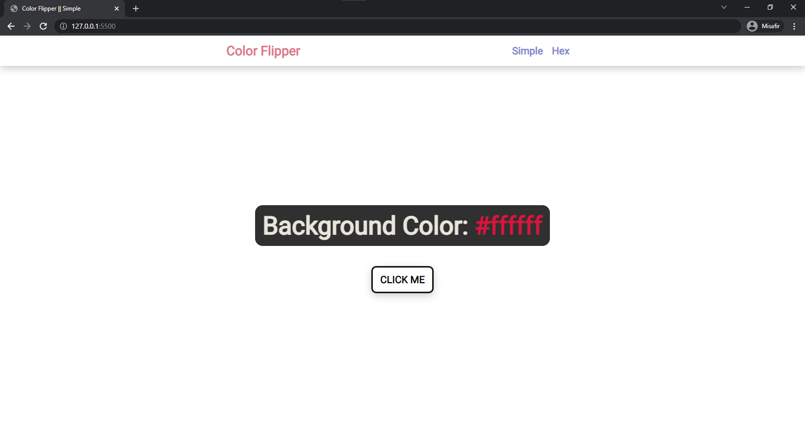
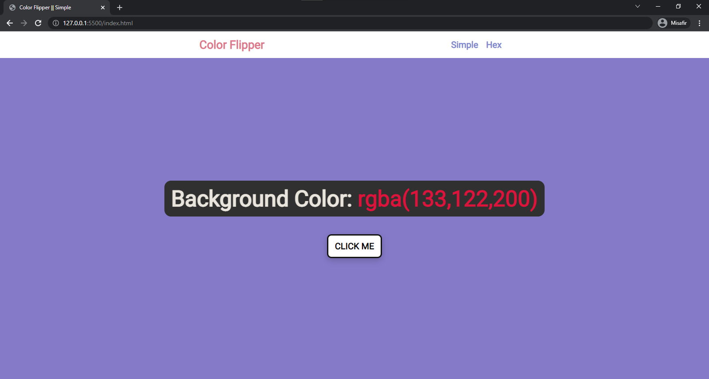
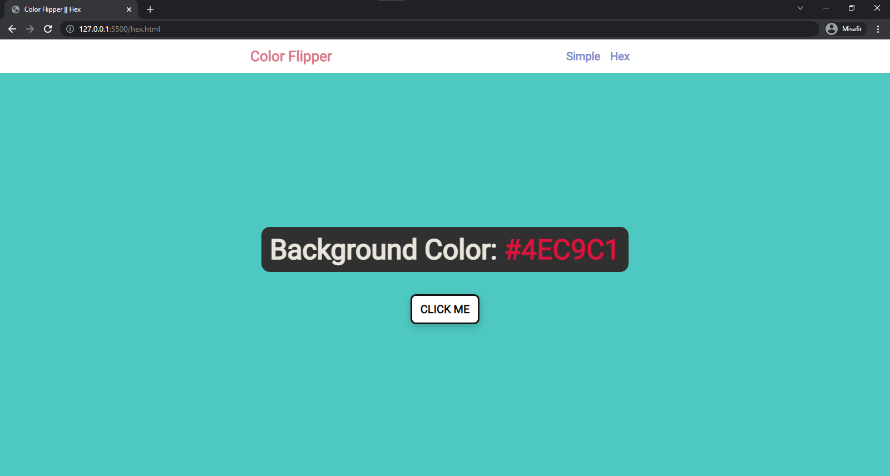
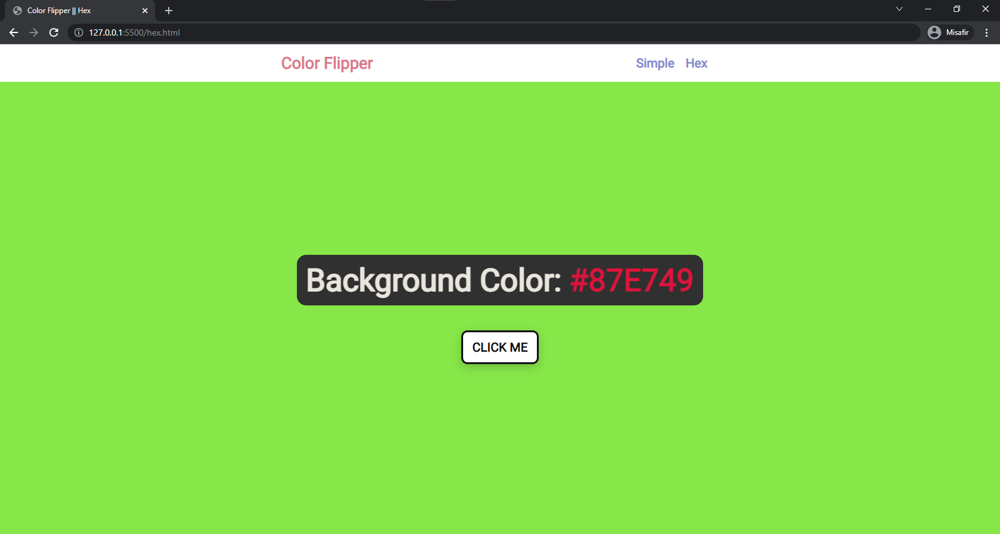

# COLOR FLIPPER 🎨

* When clicking on the button, random colors are produced in this project.

> If you click the simple section, you will see 4 different colors are randomly produced.

> If you click the hex section, you will see all color codes are randomly produced.

